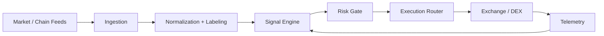

# FranklinNexus

Builder focused on high-performance systems, deterministic quant pipelines, and AI-enabled infrastructure.

[Website](https://www.kkdsmwdooo.net) · [X/Twitter](https://x.com/FranklinNexus) · [GitHub](https://github.com/FranklinNexus)

## Featured Projects

### AlphaHunter / Omni-Asset Quant Terminal

Low-latency research-to-execution system in `Rust` + `Python`.

- Result: 18 production iterations shipped
- Scope: ingestion -> signal -> risk -> execution
- Target: p95 routing latency < 50ms (benchmark in progress)

### Edge Inference Research

Hardware/software co-design on `FPGA (AX7020)` and `RISC-V`.

- Focus: operator-level quantization and memory bandwidth constraints
- Goal: maximize local inference throughput under power limits
- Output: reproducible benchmarking notes (publishing in progress)

### SurferGarage 2.0

Permissionless collaboration architecture with reputation and routing mechanisms.

- Protocol: bounty routing + immutable contribution state
- Infra: high-availability backend and automation-oriented workflows
- Design: anti-fragile operation and transparent execution rules

## Architecture Snapshot

## Now

- Building deterministic data-to-execution paths for quant systems
- Profiling edge inference bottlenecks across hardware and runtime layers

## Activity

