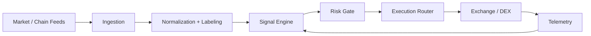

# FranklinNexus

Builder focused on high-performance systems, deterministic quant pipelines, and AI-enabled infrastructure.

[Website](https://www.kkdsmwdooo.net) · [X/Twitter](https://x.com/FranklinNexus) · [GitHub](https://github.com/FranklinNexus)

## Featured Projects

- **AlphaHunter / Quant Terminal:** low-latency research-to-execution in `Rust` + `Python`, 18 production iterations.
- **Edge Inference Direction:** FPGA and RISC-V co-design for throughput under power constraints.
- **SurferGarage 2.0:** permissionless collaboration mechanisms with transparent routing and reputation state.

## Architecture Snapshot

## Now

- Building deterministic data-to-execution paths for quant systems
- Profiling edge inference bottlenecks across hardware and runtime layers

## Activity

