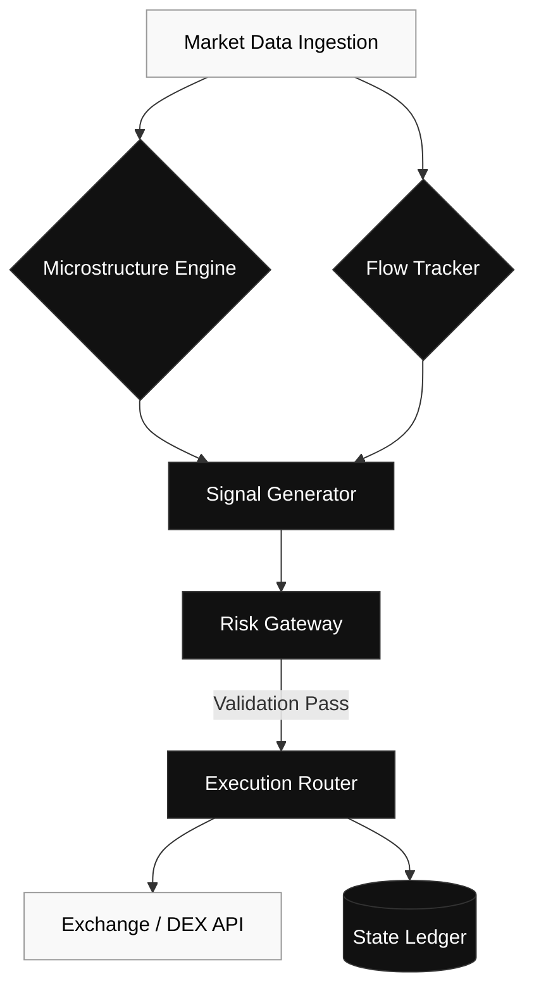

# Kurushi Minai (FranklinNexus)

CTO & System Builder. Bridging high-performance infrastructure, hardware-software synergy, and deterministic architectures.

## Now

Currently pushing the boundaries of deterministic execution and physical compute limits:

- Engineering low-latency execution routing and microstructure analysis for **AlphaHunter**.
- Profiling LLM edge inference bottlenecks on **FPGA (AX7020)** and **RISC-V** platforms.
- Architecting permissionless contribution mechanisms for **SurferGarage 2.0**.

## Systems

### 1. AlphaHunter (LASZLO) | Quant Terminal

- **Architecture:** Omni-asset data routing with strict memory management.
- **Engine:** Real-time market microstructure analysis and Smart Money flow tracking.
- **Execution:** Deterministic, low-latency order management and risk gating.

### 2. Edge Inference & Hardware Synergy

- **Hardware Target:** FPGA (AX7020), custom RISC-V instruction set extensions.
- **Focus:** Operator-level quantization, memory bandwidth optimization, and compute constraints.
- **Objective:** Maximum throughput for local inference within power-constrained edge environments.

### 3. SurferGarage | Collaborative Network

- **Protocol:** Permissionless bounty routing and immutable reputation state.
- **Infrastructure:** High-availability backend integrating MBT.AI growth tools.
- **Design:** Anti-fragile network architecture emphasizing transparency and data-driven execution.

## Architecture: AlphaHunter Execution Flow

## Proof

- **Production Iterations:** 18 versions shipped across quant terminal architecture.
- **Core Build Cycle:** 2 years of continuous system building in data and execution workflows.
- **Pipeline Scope:** Ingestion -> Signal -> Risk -> Execution (4-layer deterministic path).
- **Latency SLO (target):** p95 < 50ms for routing path (benchmarking in progress).
- **Throughput SLO (target):** >= 10k events/min parsing capacity (stress tests in progress).
- **Reliability Goal:** no single-point execution failure by design (redundant routing and risk gating).
- **Artifacts:** public benchmark notes and architecture docs will be published.

## Surface Area

Deeply invested in AI infrastructure, cross-platform system engineering, and high-frequency data pipelines. I leverage Web3 protocols strictly for decentralized consensus, robust state management, and permissionless architecture, optimizing for anti-fragility, not speculation.

## Links

- **Ecosystem:** [SurferGarage](https://github.com/FranklinNexus)
- **Connect:** [X/Twitter](https://x.com/FranklinNexus) | [Blog](https://www.kkdsmwdooo.net)

---

### Activity Metrics

