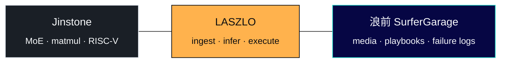

<div align="right">
  <a href="https://afdian.com/a/FranklinNexus">
    
  </a>
</div>

<div align="center">


<br/>

**Founder, [Jinstone](https://github.com/Jinstone-Limited)** · **Co-builder, [浪前 SurferGarage](https://github.com/SurferGarage)**

<sub><i>Paths on silicon · Loops on-chain · Signal before the wave</i></sub>

<br/>

<sub>在时代浪潮之前，看见路径之外的可能性</sub>

<br/><br/>

[](https://github.com/Jinstone-Limited)
[](https://github.com/LASZLO-Quantification)
[](https://github.com/SurferGarage)

</div>

---

### Thesis

Execution surfaces move slower than narratives — **and slower than models.**



Cold infrastructure on **silicon** and **chain**. **浪前** on the surface — find builders before the wave breaks.

<div align="center">

<sub><b>measure → gate → ship → audit</b> &nbsp;·&nbsp; <b>one pitch, one lane</b></sub>

</div>

---

### `whoami`

```text
┌─ stack ─────────────────────────────────────────────────────┐
│ Rust / Python · closed loops · explicit risk gates          │
├─ silicon ─────────── chain ─────────────── wave ────────────┤
│ RISC-V · FPGA       Base L2 · alpha       浪前 · playbook   │
│ routing-first       terminal              · failure-manual  │
├─ standard ──────────────────────────────────────────────────┤
│ measurable artifacts over narrative                         │
└─────────────────────────────────────────────────────────────┘

  feeds → ingest → signal → [risk] → execute → surface
                ↑___________telemetry___________↓
```

---

### Shipped

<table>
<tr>
<td width="33%" valign="top">

**Silicon**

[Jinstone](https://github.com/Jinstone-Limited)

<sub>reference designs · lab on profile</sub>

</td>
<td width="34%" valign="top">

**Chain · LASZLO**

[KeyVeil](https://github.com/LASZLO-Quantification/KeyVeil) · [Omni](https://github.com/LASZLO-Quantification/Omni-Asset-Quant-Terminal) · [docs](https://github.com/LASZLO-Quantification/.github/tree/main/docs)

</td>
<td width="33%" valign="top">

**Wave · 浪前**

[Playbook](https://github.com/SurferGarage/Startup-playbook) · [失败手册](https://github.com/SurferGarage/failure-manual) · [路径](https://github.com/SurferGarage/.github/blob/main/docs/LEARNING_PATH.md)

[surfergarage.com](https://www.surfergarage.com)

</td>
</tr>
<tr>
<td colspan="3" valign="top">

**Lab** · [Nyanpasu](https://github.com/FranklinNexus/Nyanpasu) · [Juno Oversight](https://github.com/FranklinNexus/Juno-Oversight) · [more](https://github.com/LASZLO-Quantification/.github/tree/main/docs/projects)

</td>
</tr>
</table>

---

<div align="center">

<sub>Shanghai · <a href="https://wisdomechoes.net">wisdomechoes.net</a></sub>

</div>
