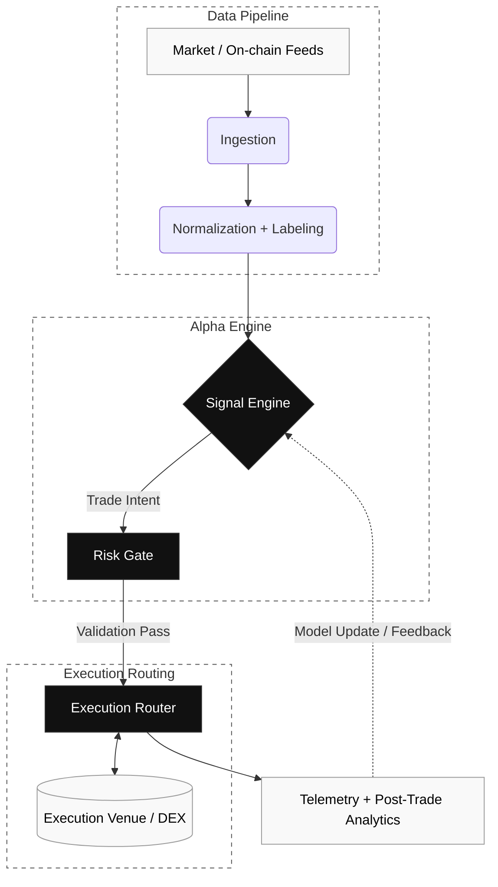

<!-- markdownlint-disable MD033 -->
# FranklinNexus

CTO & System Builder. Bridging high-performance infrastructure, hardware-software synergy, and deterministic quant architectures.

[Website](https://www.wisdomechoes.net) · [X/Twitter](https://x.com/FranklinNexus) · [GitHub](https://github.com/FranklinNexus)

 

## Core Systems

<table width="100%">
  <tr>
    <td width="72" align="center" valign="top">
      
    </td>
    <td valign="top">
      <b>AlphaHunter (LASZLO)</b> 
      Omni-asset quant terminal with low-latency research-to-execution routing in Rust and Python.  
      <a href="https://github.com/FranklinNexus/Omni-Asset-Quant-Terminal">Architecture</a> |
      <a href="https://github.com/FranklinNexus/Omni-Asset-Quant-Terminal">Core Engine</a>
    </td>
    <td width="120" align="right" valign="top">
      
    </td>
  </tr>
  <tr>
    <td width="72" align="center" valign="top">
      
    </td>
    <td valign="top">
      <b>Edge Inference & Hardware Synergy</b> 
      Profiling LLM inference bottlenecks and quantization paths on FPGA (AX7020) and RISC-V platforms.  
      Research Notes (WIP)
    </td>
    <td width="120" align="right" valign="top">
      
    </td>
  </tr>
  <tr>
    <td width="72" align="center" valign="top">
      
    </td>
    <td valign="top">
      <b>SurferGarage 2.0</b> 
      Permissionless contribution and reputation architecture with transparent routing and anti-fragile design rules.  
      <a href="https://www.wisdomechoes.net">Ecosystem</a> |
      Protocol Specs (WIP)
    </td>
    <td width="120" align="right" valign="top">
      
    </td>
  </tr>
</table>

## Architecture Snapshot

## Activity

<!-- markdownlint-enable MD033 -->
